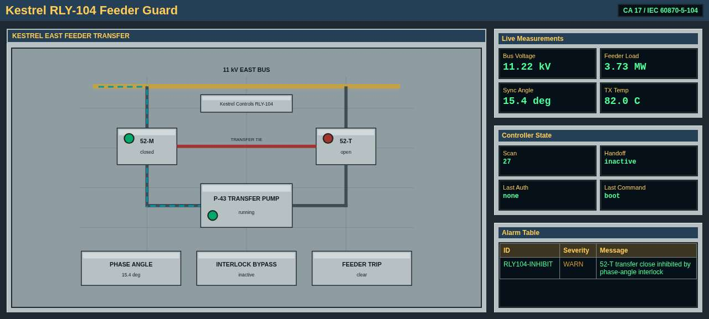
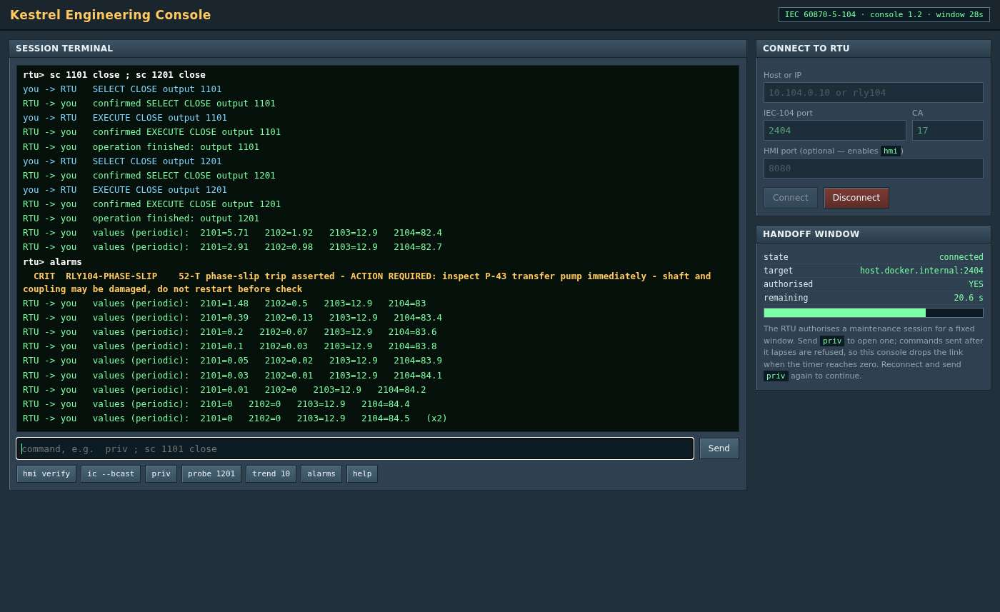
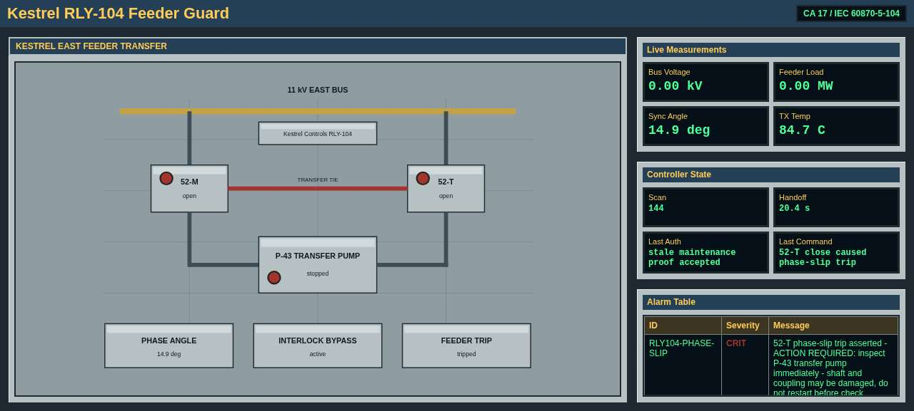

# Kestrel RLY-104 — IEC 60870-5-104 training lab

A simulated substation RTU with a web HMI, plus a browser-based engineering
console, for red-vs-blue exercises on ICS protocol attacks.

The scenario: an 11 kV feeder with two supplies. A sync-check interlock holds the
tie breaker open. An attacker who replays an old maintenance credential can
switch that interlock off and close the tie out of phase, tripping the feeder.

**Running an exercise? Start with [SCENARIO.md](SCENARIO.md).**



---

## Run it

One host, both containers:

```bash
docker compose up -d
```

| | |
|---|---|
| RTU / HMI | http://localhost:8080/ and `tcp/2404` |
| Console | http://localhost:8081/ |

Two VMs, one each: **[deploy/SETUP.md](deploy/SETUP.md)**.
Air-gapped: `./package-offline.sh` builds a single archive containing the
prebuilt image, so the VMs never pull, build, or reach a package index.

Reset the plant between runs:

```bash
docker compose restart rtu
```

---

## The lab

**RTU** — `rtu/kestrel_sim.py`, common address 17.

| IOA | Point | Direction |
|---|---|---|
| 266500 | maintenance handoff (private TypeId 104) | write, first frame of a session only |
| 1101 | interlock bypass | write |
| 1201 | 52-T tie breaker | write |
| 1301 | P-43 transfer pump | write |
| 2101-2104 | bus kV, load MW, sync angle °, transformer °C | read only |

Controls are write-only — no status points on the wire, so plant state comes from
the HMI at `/status.json` and `/alarms`.

**Console** — `console/console.py` + `console/ui.html`. Holds no target
configuration: you type the RTU's address into the page. A session lasts as long
as the RTU's ~28 s handoff window, then the console drops the link.

**Client** — `client/rtu_shell.py` for the terminal, `client/otscan.py` to find
stations on a segment. Command reference:
[docs/client-reference.md](docs/client-reference.md).

**Artifact** — `artifacts/backup.pcap`, a capture of a legitimate maintenance
session. It contains the credential.



---

## Behaviours that drive the exercise

All deliberate:

- The maintenance handoff is accepted **only as the first I-frame of a TCP
  connection**. Sent later in a session it always answers `bad proof rejected`.
- A proof from weeks ago is still accepted, and the RTU says so:
  `stale maintenance proof accepted`. No nonce, no challenge, no expiry.
- Authorisation lasts ~28 s; commands after that return `no active handoff`.
- With the interlock active, EXECUTE is refused on 1201 and 1301 — but **not** on
  1101. The bypass is not protected by the interlock it defeats.
- SELECT is confirmed even when the EXECUTE will be refused.
- The sync angle is static within a session, so waiting for a safe moment never
  works.
- Every setpoint type returns COT 44 on the analogs: the angle is readable and
  unwritable.
- Closing 52-T out of phase **while the pump is loaded** trips the feeder. Shed
  the pump first and the same close completes cleanly.



---

## Dependencies

None. Standard-library Python 3.10+, so it installs on an isolated VM.
`requirements.txt` is empty by design.
